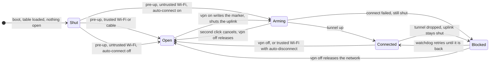

# tun0 VPN: why it is built this way

The README says what the plugin does and what it installs. This file says why, for people who want to audit it,
fork it, or understand a behaviour that surprised them. Nothing here is needed to use the plugin.

## The model

Three things describe the state of the kill switch:

```
inet vpn_ks                    the nftables table, loaded at boot and never removed
  set open                     the interfaces allowed to carry traffic outside the tunnel
/run/vpn-killswitch.active     exists = "the user wants a VPN"   ·   contents = which profile
```

Shut is the state nothing has to be done for. A systemd unit loads the table before NetworkManager starts, with
an empty `open` set: every interface that comes up is shut until something opens it. The NetworkManager
dispatcher does that at `pre-up`, the one event NetworkManager waits for before it declares an interface usable.
A cable is opened. A trusted Wi-Fi is opened. An untrusted Wi-Fi with auto-connect on stays shut, the marker is
written, and the watchdog brings the tunnel up through the shut interface: the handshake to the VPN servers is
allowed by IP, which is why the `remote` lines of the `.ovpn` files end up in the table. All of it happens before
the first packet, and before anyone is logged in. An event can only ever open; if it never fires, you are shut,
not open.



At `pre-down` and `down` the interface is taken out of the set unconditionally, whatever NetworkManager still
lists for it: the next network gets its address before its own `pre-up` runs, and a stale entry would be open
for exactly those milliseconds.

## Why shut is the default

A table that is loaded when a tunnel comes up depends on that event firing in time. A table that is loaded at
boot with nothing open depends on nothing. A missed event leaves you shut, never open. The price is that a reload
of the table must never shut an interface that should be open, which is why the `open` set is rendered from the
current verdicts every time the table is loaded, and why the set is replaced in one atomic nft batch.

## The invariant

The marker means "a VPN is wanted". It does not mean "the uplink is shut". Only the table knows that, and it
says so in `/run/vpn-killswitch.open`, which root rewrites on every decision, so an unprivileged poll can read it
without asking.

An earlier version loaded the whole table only once a tunnel was up, and `vpn on` asked "is the kill switch
on?" and got "yes" from the mere existence of the marker, left there by a connect that was still negotiating. A
second click loaded the firewall before any tunnel existed and raced a second connect against the first: half a
minute of total darkness, ended by a hand-typed `vpn off`.

Two lessons came out of it, and the second reversed the first design. A second `vpn on` never races a connect
that is still negotiating: the later one supersedes it and the first steps back. And the uplink is shut before
the handshake, not after it: the table has always let the handshake through by IP, so a shut uplink was never
the problem, the racing connects were. Negotiating on an open interface and loading the table afterwards left
every untrusted network open for the poll interval plus the handshake, and for good before login. Now the
interface is shut at `pre-up`, `vpn on` shuts it before `nmcli` is called, and switching from a running tunnel to
another country keeps the uplink shut the whole time.

## Two levels of reconnect

OpenVPN notices a dead peer on its own after 60 s (`ping 10`, `ping-restart 60`) and picks another server of the
same country, while `persist-tun` holds `tun0` and its routes in place so that nothing slips past in the
meantime. Only when NetworkManager gives up entirely does the dispatcher start the watchdog, a transient systemd
unit that waits 5 s, then tries again and again (each attempt may take up to 40 s, 10 s pause in between) until
one of the plugin's own tunnels is up or you say `vpn off`. A tunnel that is still activating, or a foreign
NetworkManager VPN, does not end the watchdog. In a test with the tunnel cut, the watchdog had it back after 7 s
with the table in place throughout.

While the kill switch holds and no tunnel exists, programs fail immediately instead of hanging, because the
rules reject with `icmpx admin-prohibited` rather than dropping packets silently.

## IPv6, link-local traffic, TunnelVision

The table is `inet`, so it governs IPv6 as much as IPv4. On a shut interface the only IPv6 that leaves is
housekeeping: neighbour discovery, router advertisements, MLD and DHCPv6. An earlier rule let the whole link-local
range through, which allowed mDNS, LLMNR and SSDP to announce the hostname on a hostile segment; a review caught
it. The VPN profiles disable IPv6 on the tunnel side, because the providers this was built against do not tunnel
IPv6.

Because the rules judge by outgoing interface and not by route, a rogue DHCP server pushing routes past the
tunnel (the TunnelVision technique, CVE-2024-3661) gains nothing: a packet steered onto the shut Wi-Fi is
rejected like any other.

## Trusted networks

A network is its SSID. Matching on the name is sound for a WPA network, because a stranger's access point with
the same name does not know your password, and not sound for an open one. A name is compared as one exact line:
an SSID may contain a line break (32 arbitrary bytes), and `grep -F` would read a multi line pattern as a list of
patterns, so "Hotel WiFi" with a trusted name hidden on a second line would have counted as trusted. Such a name
now counts as no name at all, the interface stays shut, and `vpn off` still releases it.

Your own hand wins on the network you acted on. `vpn on` or `vpn off` records the SSID in
`/run/vpn-killswitch.manual`; the automation skips that network until you change network, change the trust of
that very network, or flip one of the two automation switches. Changing the default profile, or trusting some
other network from where you are, does not touch it: releasing a hotel network for its login page must survive
you trusting the office for later.

A tunnel that comes up without anyone arming it, through a hand-typed `nmcli con up`, counts as a manual choice
too, otherwise auto-disconnect on a trusted network would tear it down at once.

## What it does not cover

- The table hooks `output`, so it governs what this machine sends. Traffic that the machine merely forwards,
  from a container or a VM that reaches the internet through the host, passes it untouched. That needs a
  `forward` chain.
- The unit does not make NetworkManager depend on it: if the table fails to load at boot, you are open, not
  offline, and `vpn status` says `NOT LOADED`. The unit is conditional on `/etc/vpn/killswitch.nft`, which
  exists once a first profile was added; `vpn add` starts it for that first profile.
- Anything that is not Wi-Fi (a cable, a USB tether, a mobile modem) counts as trusted: open unless a VPN is
  wanted.
- A config that names its servers by host name cannot connect through a shut interface, because DNS is shut
  too; `vpn add` warns. Proton and Mullvad ship IP addresses.
- `vpn off` on an untrusted network opens it until you change network, on purpose, and that includes waking up
  on the same network tomorrow.
- An interface that loses its access point is shut by the `down` event, which NetworkManager does not wait for;
  the next association takes seconds, so the entry is long gone, but that is timing, not construction. A
  deliberate switch goes through `pre-down`, which NetworkManager does wait for. Measured: 2.6 s of margin.
- After a Wi-Fi change with a persistent tunnel NetworkManager may not report `vpn-down`; OpenVPN's own
  `ping-restart` reconnects within 60 s and the panel shows the tunnel as stalled meanwhile. The interface stays
  shut throughout.
- The sudoers rule means any process running as you can open the kill switch. It protects you from the network,
  not from software you run.
- The first bootstrap trusts the commit, the digest and the key it is given, and those are only as good as the README
  they are copied from: the README at the commit the marketplace verified (the release tag's README holds placeholders,
  which the bootstrap refuses), with the key compared against the account's signing keys. From then on the key is
  pinned, and a later bootstrap with another key stops before it changes anything; a README changed on GitHub that keeps
  the key still needs a commit that key signed. What runs in the user's own terminal while the bootstrap is pasted is
  outside what it can check. Running `install.sh` by hand, past the bootstrap, trusts that tree.
- The public IP lookup sends one request to ipinfo.io whenever the state changes to connected or off; ipinfo.io learns
  that this address uses the plugin at those moments. `vpn lookup off` turns it off.

## The boundary between you and root

A plugin folder belongs to you, and so does every program you run. Whatever root reads from there, it reads in a
state some program running as you may have set a moment earlier: a script replaced between typing `sudo` and its
start, a file swapped between the check and the copy, a link where a file was. So root reads nothing from there.

- **Where the root side comes from: a bootstrap that checks before anything runs.** A check inside a release protects
  nothing on the way in, because a changed release would simply leave it out, and it would already be running as root
  when it got to it. So the root side is installed by a bootstrap the user pastes, whose bytes come from the README and
  not from the release it fetches. It runs as root with an empty environment and every command by its full path. Before
  it touches anything it refuses placeholder values, any directory from `/` down to `/usr/local/lib` that anyone but
  root can write to, and, on an update, a key other than the one pinned in `/etc/vpn/release-signer`: a check of the
  pin inside `install.sh` would come after the fetched code already runs. git gets no global or system configuration,
  no hooks, no fsmonitor, no password prompt, HTTPS as its only transport, a minimum transfer speed, object checks on
  fetch, and no signature program but `ssh-keygen` (`gpg.format` does not decide how a signature is checked, the
  signature does, so gpg and gpgsm are switched off). It creates an empty repository in `/usr/local/lib/tun0-vpn`,
  fetches exactly one commit by its full hash, and checks, before anything of it is checked out, that the commit is
  signed by the release key and that its `SHA256SUMS` has the SHA-256 the README names. Only then does it check the
  files out, check every file `SHA256SUMS` lists (everything `install.sh` installs, and `install.sh` itself; README,
  DESIGN, CHANGELOG and LICENSE are bound by the commit only, and nothing runs them) and that no file outside the
  commit is in the tree, and start `install.sh --commit`.
  `install.sh` repeats the checks (commit, signature, clean tree, ownership chain, digests), compares the release key
  with the one pinned in `/etc/vpn/release-signer` and refuses a release older than the one recorded in
  `/etc/vpn/installed-release`. The marketplace security review asked for exactly this order.
- **Two commits per release.** A README cannot name the hash of its own commit. So a release is a signed release
  commit with its tag, followed by a signed commit that changes nothing but the README, writing that release commit's
  hash and the digest of its `SHA256SUMS` wherever the README names them. `git diff <release commit> <that commit>`
  shows these values and nothing else.
- **Updates.** An update is the same bootstrap with the values of the newer release. There is no updater on the
  machine: an updater that accepts whatever the release key signs would install a release nobody reviewed. 1.1.0
  shipped one (`vpn-update`); `install.sh` removes it.
- **What is installed.** Each file, the widget files included, is checked in the tree for its canonical path, owner
  and mode, then copied into a staging directory only root can read, and the SHA-256 of that copy is checked against
  `SHA256SUMS` in the signed commit. The copy is what is installed; the tree is not read again, so a file changed
  after the check does not reach the system.
- **Nothing of anyone else's.** Every file `install.sh` writes names itself as `tun0 VPN` in its first lines (the
  two scripts of 1.0.0 that did not are recognised by their own first comment), the dispatcher links point at its
  script, and `/etc/vpn` holds only the entries the helper writes. A file under one of these names that is not tun0
  VPN's stops the installation before anything changes, and `vpn-uninstall` removes by the same rule: an admin's own
  `/etc/sudoers.d/vpn` or a `~/.local/bin/vpn` of another tool stays where it is. No package is installed either:
  `install.sh` checks for `networkmanager-openvpn`, `python-gobject`, `nftables`, `jq`, `curl` and sudo 1.9.10, and
  names what is missing.
- **Nothing half way.** What would otherwise fail after the sudoers rule is gone is checked first: that you can
  write where the `vpn` command and the widget go, that the configs named on the command line are readable, and
  the credentials they need are asked for. If it stops anyway, it says that the rule stays removed until it runs
  through. Git runs with root's own home and no global configuration, so no fsmonitor program or signing program of
  yours runs as root.
- **The sudoers rule.** It admits the helper only in the argument forms the user side sends, matched whole, and it
  names the user by id. Every form carries the SHA-256 of the `vpn-root` the release installed: sudo checks it on each
  call immediately before it runs the helper, and runs the bytes it checked through a file descriptor, so a helper
  changed after the installation is refused instead of run as root. The helper calls itself by its path, not by `$0`,
  which under sudo is `/dev/fd/N` and only works while that descriptor is inherited. The verbs only the dispatcher and the units call as root are not
  in it. `install.sh` removes
  the rule first and writes it last, once everything else is in place.
- **The helper.** Every argument is checked against a fixed form before it is used. An interface name goes into an
  nft batch, so a name with a quote in it could have carried commands of its own; a profile name is a path piece.
  A config and credentials arrive as bytes on stdin: a helper that opens a path its caller names reads whatever that
  name points to by the time it opens it. The config itself must not name files either: NetworkManager's importer,
  which runs as root in the helper, keeps a path for `ca`, `cert`, `key`, `tls-auth`, `tls-crypt`, `secret` and the
  like and reads it later as root, and for `http-proxy` and `socks-proxy` it reads the credentials file at once into
  the connection, whose first line you can read back. Scripts (`up`, `down`, `plugin`) it drops, which is why
  Proton's configs pass; the helper still removes every script and plugin hook from the copy it imports (the
  connection is the same with and without them, measured), so nothing root runs rests on the importer of whichever
  NetworkManager is installed. The importer also splits a line at a carriage return or form feed where a check by fields
  does not, so a control character inside a line is refused before the check, and the same check runs again before
  every import, for configs stored before it existed. Credentials go to NetworkManager through libnm (Python on
  stdin), never as an argument of `nmcli`, where the process list would show them. Every input has a limit and is
  refused above it, not cut. A NetworkManager connection is brought up, taken down and deleted only by UUID and only if
  it is a VPN, never by a name another connection may carry too. The kill
  switch lets each server through only on the port and protocol its config names, as pairs, not every listed address
  on every listed port. Its tools come from `PATH=/usr/bin` only, never from the caller's, and the helper, the
  installer, the updater and the uninstaller set `LC_ALL=C`, because sudo passes the caller's locale on. The helper
  starts as `bash -p`, so no `BASH_ENV`, exported function or `SHELLOPTS` from the environment reaches it, even where a
  site's sudo configuration would pass them on.
- **The widget.** The processes it starts run by absolute path under `timeout`, with an environment cleared down to
  what `vpn` needs, and their output is kept only up to 256 KiB: a process that says more is stopped. Everything it
  shows is plain text, never rich text, and what `vpn json` and `vpn public` hand it is built with `jq`, with every
  string from the network or a config cleaned of control and direction characters and capped. When the poll fails,
  the panel says the state is unknown instead of showing the last good one.
- **Downward, not upward.** Where root has to touch your home (the `vpn` command, the widget, a config you name
  on the installer's command line), it does so through `sudo -u` with your rights, so a link placed there leads
  nowhere you could not already go yourself.

## Design notes

- NetworkManager, not an `openvpn-client@` unit. Omarchy runs NetworkManager with systemd-resolved. The NM
  plugin registers the DNS the server pushes with resolved and removes it again afterwards; Proton's
  `up/down update-resolv-conf` hooks do not exist on Arch.
- `ipv4.dns-priority -1`. Negative means exclusive: while the VPN is up, resolved queries only the tunnel DNS.
  Without it, queries go to the Wi-Fi resolver in parallel, which is a leak.
- `mssfix 1400` and `tunnel-mtu 1400`. Some providers ship `tun-mtu 1500` with `mssfix 0`, meaning off; Proton
  does. On a link whose path MTU is below 1500 (train Wi-Fi, 1438 in the test), DNS works and HTTPS hangs,
  because the ServerHello does not fit. At home the lower values cost nothing noticeable.
- `vpn-down` does not clean up. NetworkManager fires it for an intended disconnect and for a drop alike; the
  marker is what tells them apart. Cleaning up on `vpn-down` would switch the kill switch off in exactly the
  situation it exists for.
- The policy runs in the dispatcher at `pre-up`; the poll only shows it. An earlier version ran the
  trusted-network logic inside the bar's poll, in user space, which was convenient and wrong in the one way that
  matters: it could not run before login, and it left every untrusted network open for up to five seconds plus
  the handshake. A dispatcher runs as root and before anyone is logged in. So the trusted list, both switches and
  the default live in `/etc/vpn`, written through the same helper the sudoers rule already covers, and the poll's
  only remaining job is to turn root's last decision (`/run/vpn-killswitch.event`) into a toast with a "trust
  this network" button.
- The state lives in `/run`, not behind `sudo`. The bar icon polls every 5 s. Asking root that often would write
  a journal line every 5 s, forever. So root writes what the poll needs: the marker, the open interfaces, the
  last decision. One `flock` around every decision keeps the dispatcher, the watchdog and the user's own command
  from applying a set computed from a state that changed underneath.
- One NM profile per provider and country. The list is defined as "every NetworkManager VPN profile that has a
  config in `/etc/vpn/configs`", so a new provider shows up without a code change, and VPN profiles you set up
  yourself by other means are neither shown nor touched.
- A `gum` wizard instead of a chain of dialogs. Omarchy's own menu input offers neither pre-filled values nor
  masking, and Omarchy itself runs multi step flows in a floating terminal with `gum`. So does this.
- `vpn status` asks ipinfo.io where the traffic comes out, because the tunnel's own state is not proof of
  anything. The widget does the same when the state changes, never on a timer, and `vpn lookup off` stops both.
- English in the UI. Omarchy's menu, bar and notifications are in English and the system runs `LANG=en_US`; a
  German submenu would be a foreign body.

## Versioning

The version lives in `manifest.json` only. `vpn version` prints the installed one. Every release is two signed
commits on `main`: the release commit, tagged `vX.Y.Z`, and the commit that writes its hash and the digest of its
`SHA256SUMS` into the README (see the boundary above). A GitHub release carries the CHANGELOG section; between releases
`main` stands still, because the marketplace pins a listing to an exact commit.
