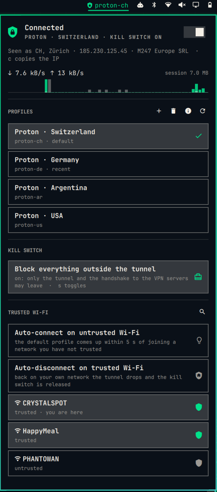

<div align="center">

```
    ███     ███    █▄  ███▄▄▄▄    ▄██████▄        ▄█    █▄     ▄███████▄ ███▄▄▄▄
▀█████████▄ ███    ███ ███▀▀▀██▄ ███  ▄████      ███    ███   ███    ███ ███▀▀▀██▄
   ▀███▀▀██ ███    ███ ███   ███ ███  █▀███      ███    ███   ███    ███ ███   ███
    ███   ▀ ███    ███ ███   ███ ███ ▄█ ███      ███    ███   ███    ███ ███   ███
    ███     ███    ███ ███   ███ ███ █▀ ███      ███    ███ ▀█████████▀  ███   ███
    ███     ███    ███ ███   ███ ███▄█  ███      ███    ███   ███        ███   ███
    ███     ███    ███ ███   ███ ████▀  ███      ███    ███   ███        ███   ███
   ▄████▀   ████████▀   ▀█   █▀   ▀██████▀        ▀██████▀   ▄████▀       ▀█   █▀
```

**Your OpenVPN profiles in the Omarchy bar, with a kill switch of its own.**

`tun0` is what the kernel calls the tunnel interface.
This plugin makes sure that, once you have asked for a tunnel, your packets leave through it or not at all.

[](LICENSE)




</div>

One bar icon, one panel, one command. Connect to any of your OpenVPN profiles (`proton-ch`, `mullvad-se`,
whatever you have added), switch countries without a gap, and block everything that would leave outside the
tunnel: when it drops, and in the seconds before it is up. What it does not cover is listed under
[The kill switch](#the-kill-switch).

```
VPN:         connected, Proton · Switzerland (proton-ch)
Kill switch: on - uplink shut, only the tunnel may carry traffic
Public IP:   79.135.104.7
Seen as:     Switzerland (CH), Zürich · Proton AG
```

That last line is the point: `vpn status` does not take the tunnel's word for it, it asks the internet where you
come out.

Compared with the other OpenVPN launchers for Omarchy: provider neutral, its own nftables kill switch instead
of the provider app's, a reconnect watchdog, an import wizard that never needs a terminal, and with
auto-connect on it shuts an untrusted Wi-Fi before its first packet and brings the tunnel up through it.

What it is not: OpenVPN only. WireGuard, provider apps with their own protocols and clients that insist on their
own daemon are out of scope.

**Contents:** [Install](#install) · [Requirements](#requirements) · [Add a profile](#add-a-profile) ·
[Everyday use](#everyday-use) · [Trusted Wi-Fi](#trusted-wi-fi) · [The kill switch](#the-kill-switch) ·
[Permissions](#permissions) · [Update](#update) · [Uninstall](#uninstall) · [Command reference](#command-reference) ·
[Status](#status) · [License](#license)

---

## Install

```bash
sudo pacman -S --needed networkmanager-openvpn                         # the one requirement Omarchy does not ship
omarchy plugin add https://github.com/rogertobler/omarchy-tun0-vpn     # the widget, like any other plugin
sudo git clone --depth 1 --branch v1.1.0 https://github.com/rogertobler/omarchy-tun0-vpn /usr/local/lib/tun0-vpn
sudo /usr/local/lib/tun0-vpn/install.sh                                # the part that needs root, once
vpn add ~/Downloads/ch.protonvpn.udp.ovpn                              # or: open the panel, press +
vpn on && vpn status
```

The root side is installed from its own copy of the release, cloned by root into a directory only root can write
to, never from the plugin folder: that folder belongs to you, and so does every program you run, which could change
a script there while `sudo` runs it. `install.sh` refuses to run from anywhere else, checks that the release tag is
signed by the release key and that every file it installs matches the digest in the signed commit, and only then
changes the system. This first installation trusts the tag it clones from GitHub; from then on the release key is
pinned on your machine, and [Update](#update) checks every later release against it before anything of that release
runs. How, in detail: [How the root side is installed](#how-the-root-side-is-installed).
Read [Permissions](#permissions) before you run it; it is short.

Coming from 1.0.0: skip `omarchy plugin add` (the widget is there already), then clone and run `install.sh` as
above. `install.sh` refreshes a widget folder the 1.0.0 installer copied; a folder `omarchy plugin add` cloned is
updated with `omarchy plugin update rogertobler.tun0-vpn`.

## Requirements

Omarchy 4.0.x and `networkmanager-openvpn`, which Omarchy does not ship:

```bash
sudo pacman -S --needed networkmanager-openvpn
```

Everything else ships with Omarchy: `nftables`, `NetworkManager`, `systemd`, `git`, `openssh` (to check the release
signature), `sudo` 1.9.10 or later (for the argument patterns of the sudoers rule), `python3` with `python-gobject`
(to hand credentials to NetworkManager), `jq`, `curl`, `gum`, `fzf`, `wl-clipboard`. `install.sh` installs no
packages: before it changes anything it checks for `networkmanager-openvpn`, `NetworkManager`, `nftables`, `openssh`,
`python3` with `python-gobject`, `jq`, `curl` and sudo 1.9.10, and names what is missing.

## Add a profile

Any `.ovpn` with `remote` lines works; the plugin has no provider built in. The two below are the ones it was
built against, listed because each has a step that trips people up.

| Provider | Config | Credentials |
|---|---|---|
| **Proton** | account.protonvpn.com, Downloads, **Country configs**, protocol **UDP**. One file holds every server of that country | the **OpenVPN / IKEv2 credentials** from your account page, not your account password |
| **Mullvad** | the OpenVPN config generator | account number as username, password `m` |
| **anyone else** | any `.ovpn` with `remote` lines, servers as IP addresses (see [The kill switch](#the-kill-switch)), certificates and keys inline | whatever they hand you |

Certificates and keys have to be inside the file (`<ca>...</ca>`, `<tls-crypt>...</tls-crypt>`), as in Proton's
country configs. A config that names a separate file for `ca`, `cert`, `key`, `pkcs12`, `tls-auth`, `tls-crypt`,
`tls-crypt-v2`, `crl-verify`, `secret` or `extra-certs` (including the word `[inline]`, which the importer takes as a
file name), or a credentials file for `http-proxy` or `socks-proxy`, is refused: NetworkManager's importer, which runs
as root here, would read those paths with root's rights. So is a control character other than a tab inside a line;
Windows line ends are fine. A `remote` line without a port gets the config's `port` (or `rport`), else OpenVPN's 1194,
in the tunnel and in the kill switch.
Script hooks (`up`, `down`, `plugin`, `script-security` and the like) are left out of the copy NetworkManager
imports; NetworkManager ignores them anyway, so Proton's `up`/`down` lines change nothing.

Then either **the `+` next to PROFILES** in the panel, or `vpn add <file>`:

```
Where is the OpenVPN config?
> A file in ~/Downloads or ~
  Paste from the clipboard
  Type a path
```

Pick a source, confirm the name, enter the credentials once per provider with the password masked, done. The
name is `<provider>-<country>`, lowercase, one dash; the provider half is a label you choose (`windscribe-jp`,
`work-vpn`, `homelab-ch` all work), and the wizard suggests one from the file name. A wrong path, a file without
a `remote` line, a taken name or empty credentials send you back to that step, not to the
start.

Several at once, also from different providers, as `NAME FILE` pairs to the installer. It opens those files with
your rights, not root's, and hands their contents to the root helper:

```bash
sudo /usr/local/lib/tun0-vpn/install.sh proton-ch ~/Downloads/ch.protonvpn.udp.ovpn mullvad-se ~/Downloads/mullvad_se_all.conf
```

> [!NOTE]
> No affiliation with any VPN provider. Provider names appear here only to point at the right download page, and
> in the code only to capitalise a label and to recognise a file name.

## Everyday use

| | What you see | Means |
|---|---|---|
| ⚪ | outline shield, no label, dimmed | off: nothing running, nothing blocking |
| ⏳ | outline shield · `proton-ch…`, breathing | connecting |
| ✅ | **filled** shield · `proton-ch` in the theme's **accent colour** | connected, uplink shut |
| 🔴 | crossed shield · `proton-ch` in **red**, breathing | **no tunnel.** The kill switch is holding the line, the watchdog is retrying |
| 🔴 | crossed shield · `Reconnecting…` in **red**, breathing | **stalled**: the tunnel is up but nothing flows, because the Wi-Fi lost its link or the server stopped answering; OpenVPN restarts it |
| 🔴 | crossed shield in **red**, panel says `State unknown` | the widget cannot read the state (`vpn json` failed or said too much; the panel names the reason). Traffic may or may not flow; nothing in the panel acts until the state can be read, right-click refreshes |

Red means: no traffic is going through a tunnel and nothing leaves, or the widget cannot read the state at all.

| Click | Does |
|---|---|
| left | opens the panel |
| right | connect to the default, or disconnect |
| middle | refresh |

**The panel**, top to bottom:

- the state, the profile and the kill switch, and the one switch that matters
- *seen as*: city, IP, provider, the only real proof the tunnel is doing anything
- throughput while a tunnel is up, sixty seconds of history as a sparkline
- your profiles, default first, recently used next; click one to connect, the active one is filled
- the kill switch as a status row, lit while on, red once you turned it off
- trusted Wi-Fi: the two automation rows, then the network you are on, every trusted one and the last three you
  used, a shield each; *show all* unfolds every network NetworkManager knows, `/` searches it

One switch in the whole panel, on purpose: everything else is a row that lights up when on, so the master switch
is what the eye lands on. The buttons next to PROFILES open the add and remove wizards, the full status in a
terminal, and refresh.

Keyboard: `j`/`k` or arrows move, `enter` flips the row under the cursor, `t` toggles the tunnel, `s` the kill
switch, `n` trusts the network you are on, `d` makes the profile under the cursor the default, `a` adds, `x`
removes, `i` opens the status page, `c` copies your public IP, `r` refreshes, `w` shows all networks or fewer,
`esc` closes, Tab switches to the neighbouring panel.

**Settings**, by right-clicking the bar or in the widget's entry in `~/.config/omarchy/shell.json`:

| Key | Default | What it does |
|---|---|---|
| `refreshIntervalSec` | `5` | how often the bar re-reads the state while idle. With the panel open, or while something is in flight, it polls every second by itself |
| `showName` | `true` | the profile name next to the shield. Off = icon only |
| `highlightConnected` | `true` | paint the shield in the accent colour while the tunnel is up |
| `showRateInBar` | `false` | append the current download rate to the bar label while connected |

**Network activity.** Everything runs locally except one thing: the *seen as* line and `vpn status` ask
`https://ipinfo.io/json` (IPv4, no account) where your traffic comes out. The widget asks when the state changes to
connected or off and when you refresh, never on a timer. One request, HTTPS only, no redirects, 5 s at most, and at
most 16 KiB of answer; only the IP address, the country code, the city and the provider are kept, each checked and
cleaned of control characters before the panel shows it. `vpn lookup off` turns it off for good (the panel then says
so), `vpn lookup on` back on.

## Trusted Wi-Fi

Hotel, train, café: you want the VPN the moment you join. At home you want the printer. Two switches in the
panel's trusted Wi-Fi section, both off until you turn them on:

| Row | What it does |
|---|---|
| **Auto-connect on untrusted Wi-Fi** | join a network that is not on the list and the interface is **shut before its first packet**; the default profile comes up through it, and nothing else leaves in between. Works before you are logged in. A notification offers to trust the network |
| **Auto-disconnect on trusted Wi-Fi** | back home, the tunnel goes down and the network is opened, so the LAN works again |

With auto-connect off, an untrusted Wi-Fi is opened like a trusted one: the shut-first behaviour is what that
switch turns on. Anything that is not Wi-Fi (a cable, a USB tether, a mobile modem) counts as trusted.

**What counts as trusted.** A network is its SSID. Nothing is trusted until you say so. Matching on the name is
safe for a WPA network, whose password a stranger's access point does not know, and not safe for an open one:
anyone can broadcast "Free Airport WiFi", so do not trust open networks.

**Editing the list.** In the panel (click or Enter on a network row, `n` for the one you are on, *show all* for
the office before you get there), with `vpn trust edit` in a terminal, or with `vpn trust add|remove <SSID>`.

**Captive portals.** With auto-connect on, a hotel's login page cannot load: the network is shut and the panel
shows the watchdog retrying. `vpn off` releases that one network until you change network; log in, then
`vpn on`.

**Your own hand wins.** Connect or disconnect by hand and the automation leaves that network alone until you
change network, change the trust of that very network, or flip one of the two switches. `vpn status` shows the
network, its trust, both switches, and whether the automation is paused there.

## The kill switch

> [!CAUTION]
> **No warranty.** This is a kill switch written by one person and tested on one laptop. It is published under
> the MIT licence, which means as is, without warranty of any kind, and no liability for anything that leaks.
> Read [what it does not cover](#the-kill-switch) below and test it on your own network before you rely on it:
> join an untrusted Wi-Fi, run `vpn status`, and check `journalctl -t vpn-root` for "interface stays shut".

One nftables table, loaded at boot before NetworkManager, allows only: the tunnel, the handshake to your VPN
servers (each server address only on the port and protocol its config names for it), DHCP, loopback, IPv6 neighbour
discovery, and the interfaces it has been told to open. A
NetworkManager dispatcher decides at `pre-up`, before an interface is usable, whether it is opened: trusted Wi-Fi
and cable yes, untrusted Wi-Fi with auto-connect no. An event can only open; if it never fires, you are shut,
not open.

A marker in `/run/vpn-killswitch.active` means "a VPN is wanted". While it exists the uplink stays shut: through
a dropped tunnel (OpenVPN reconnects itself, then a watchdog retries every 10 s until it is back), through a
switch to another country, and through a second click during a connect, which supersedes the first instead of
racing it. Programs fail at once rather than hanging, because the rules reject instead of dropping.

Because the rules judge by outgoing interface and not by route, a rogue DHCP server pushing routes past the
tunnel (TunnelVision, CVE-2024-3661) gains nothing. The table is `inet`, so IPv6 is covered too.

**What it does not cover:**

- traffic this machine merely forwards, from a container or a VM: the table hooks `output`, not `forward`
- a table that fails to load at boot: you are open, not offline, and `vpn status` says `NOT LOADED`
- open networks trusted by name (above), and any process running as you: the sudoers rule lets it open the kill
  switch, so this protects you from the network, not from software you run
- a config that names its servers by host name: DNS is shut too, so it cannot connect through a shut interface
  (`vpn add` warns; Proton and Mullvad ship IP addresses)
- `vpn off` on an untrusted network opens it until you change network, on purpose, tomorrow included

**Off, on purpose.** `vpn killswitch off` (or the panel row) removes the table and keeps profiles, watchdog and
tunnel as they are, for the printer; `on` loads it again. The panel says `kill switch disabled` meanwhile. The
emergency exit from root's side is `sudo systemctl stop vpn-killswitch`: table gone, VPN no longer wanted,
nothing reloads it until you start the unit again. There is no LAN exception while it is on; if you want one, add
`ip daddr 192.168.1.0/24 accept` before the `reject` line in `/etc/vpn/killswitch.nft.in` and run
`sudo /usr/local/bin/vpn-root rebuild` (an update overwrites the file, so keep a copy).

How it is built, why, and the incidents that shaped it: [DESIGN.md](DESIGN.md).

## Permissions

> [!WARNING]
> This is not a pure QML plugin. A firewall-backed kill switch cannot be built without root. Every item below is
> listed so that you can decide.

| What | Where | Why |
|---|---|---|
| **The release** | `/usr/local/lib/tun0-vpn/`, writable by root only | the clone `install.sh` installs from, and runs from. Nothing root installs comes from a folder you can write to |
| **A pinned release key** | `/etc/vpn/release-signer` | written at the first installation; `vpn-update` accepts only releases signed by it, and `install.sh` refuses a release that names another key |
| **The installed release** | `/etc/vpn/installed-release` | version and commit, written last; neither `vpn-update` nor `install.sh` goes back to an older release |
| **A root helper** | `/usr/local/bin/vpn-root` | loads the nftables table, opens and shuts interfaces in it, writes the marker, keeps the trusted list and the settings, imports NetworkManager profiles, stores configs and credentials, runs the watchdog |
| **A sudoers rule** | `/etc/sudoers.d/vpn` (mode 0440), bound to the user id of whoever ran the installer | lets that user run **that one script** without a password, only in the argument forms the user side needs, and only while it has the SHA-256 the release installed. No `ALL`, no shell, no interpreter |
| **A dispatcher script** | `/etc/NetworkManager/dispatcher.d/90-vpn-killswitch`, linked into `pre-up.d/` and `pre-down.d/` | opens a trusted or wired interface before NetworkManager declares it usable, keeps an untrusted one shut, shuts it again at `pre-down`, and learns when a tunnel came up or went away |
| **A systemd unit, enabled** | `/etc/systemd/system/vpn-killswitch.service`, `Before=network-pre.target` | loads the table at boot, before NetworkManager, once a first profile exists (the unit is conditional on `/etc/vpn/killswitch.nft`); from then on no interface comes up open |
| **A transient unit** | `vpn-reconnect`, via `systemd-run` | the watchdog. Not enabled, gone after a reboot |
| **Files under `/etc/vpn/`** | configs and credentials root only (`600`), trusted list and settings world readable | the dispatcher reads them before anyone is logged in |
| **The widget** | `~/.config/omarchy/plugins/rogertobler.tun0-vpn/` and one layout entry in `~/.config/omarchy/shell.json`, written by `omarchy plugin enable` | the shield and the panel. A folder `omarchy plugin add` cloned is left to Omarchy; a folder without git gets the checked widget files of the release, written with your rights |
| **Three scripts** | `~/.local/bin/vpn`, `/usr/local/bin/vpn-update`, `/usr/local/bin/vpn-uninstall` | the user side, the updater of the root side, and a copy of the uninstaller that survives `omarchy plugin remove` |

What it does not do: no `curl | sh`, nothing it downloads or updates on its own (the first clone and every
update are commands you type; an update is checked against the pinned key before any of it runs), no daemon, no
profile connects on its own unless auto-connect is on.

The attack surface of the sudoers rule: the helper's actions are fixed, and the rule itself admits only these
argument lists, each matched whole:

```
off | status | watch | unwatch | trust set
on | arm | add | remove  <provider>-<country>
auth | has-auth          <provider>
set killswitch | autoconnect | autodisconnect  on | off
set default              <provider>-<country>
trust add | remove       <SSID>
```

Each form carries the SHA-256 of the `vpn-root` this release installed: sudo checks the helper against it on every
call, right before it runs it, and runs the bytes it checked (by file descriptor), so a `vpn-root` with other bytes is
refused. The verbs the dispatcher and the systemd units call as root (`boot`, `unload`, `netevent`, `sync`,
`reconnect`, `rebuild`) are not in it. The helper checks every argument against the same forms again before it uses it: a
profile name is `^[a-z0-9]+-[a-z0-9]+$` and on `remove` only a name that has a config in `/etc/vpn/configs/`, so it
can neither delete your Wi-Fi connection nor reach a file outside that directory; a provider is `[a-z0-9]+`; an
SSID is written to a root-owned file and never interpreted; settings have fixed keys and values. A config and the
credentials arrive as bytes on stdin, never as a path root would open with its own rights, and never as arguments;
the helper hands the credentials to NetworkManager through libnm, so they never show in a process list. Inputs have
limits and are refused above them, never cut: a config 1 MiB, credentials 4 KiB, a trusted name 128 bytes, the
trusted list 1024 names, 64 profiles, 4096 server endpoints. The helper finds its tools through `PATH=/usr/bin` only,
never through the caller's. A NetworkManager connection is brought up, taken down and deleted only by its UUID and only
if it is a VPN, by the helper, the watchdog and the `vpn` command alike: a Wi-Fi that happens to be called `proton-ch`
is left alone.

### How the root side is installed

`install.sh` changes nothing before all of this has passed:

- it runs from exactly `/usr/local/lib/tun0-vpn/install.sh`, every directory from `/` down to that tree and
  everything in the tree belongs to root and is writable by root only, and nothing in the tree is a link
- what it needs is installed (see [Requirements](#requirements)); it installs no packages itself
- the checkout is the unmodified commit of the release tag `v<version>`, and that tag is signed by the release key.
  That key is written into `install.sh` and listed as a signing key of the GitHub account
  ([rogertobler](https://api.github.com/users/rogertobler/ssh_signing_keys), fingerprint
  `SHA256:BP0m/tn2dfpS+7xOCWmG6ioYfUrbdSIqmNHNuRb/txQ`). If a key is already pinned in `/etc/vpn/release-signer`,
  it must be that one; the release must not be older than the one recorded in `/etc/vpn/installed-release`; and
  every tag in the clone must name itself as it is called, so a signed tag served under another name is refused.
  The clone must have been made with `--branch v<version>`, so a branch or an unsigned tag named like a newer release
  on the commit of an older one does not install that older release
- each file it installs, the widget files included, is checked in the tree for its canonical path, owner and mode,
  then copied into a staging directory only root can read, and the SHA-256 of that copy is checked against
  `SHA256SUMS` of the signed commit. What is installed is that copy, never the tree again
- every file it would replace was put there by tun0 VPN: its files name themselves as `tun0 VPN` in their first lines,
  the dispatcher links point at its script, and `/etc/vpn` holds only its own entries. A file of another package or of
  your own under one of these names (`/etc/sudoers.d/vpn`, `~/.local/bin/vpn`, ...) stops it, and it names the file
- you can write where the `vpn` command and the widget go, the configs named on its command line are readable, and
  the credentials they need have been asked for

Then it removes the sudoers rule, installs everything else, and writes the rule (bound to the digest of the
`vpn-root` it installed), the pinned key (the first time) and the installed release last. If it stops in between, it says that the rule stays removed until it runs through. Your
home directory (the `vpn` command, the widget) is written with your rights, not root's.

What this does not cover: the first installation trusts the tag it clones from GitHub, and the key named in that
release. It prints the fingerprint it pins; compare it with the one above and with the account's
[signing keys](https://api.github.com/users/rogertobler/ssh_signing_keys). The protection against a changed
repository starts with the second release, through `vpn-update`.

## Update

```bash
omarchy plugin update rogertobler.tun0-vpn
sudo /usr/local/bin/vpn-update v1.1.0
```

Name the release you update to. `vpn-update` is the updater of the release installed now, not of the new one: it
fetches the tag from this repository into `/usr/local/lib/tun0-vpn` (afresh every time, so a tag a server once
served wrong does not stay), and before anything of the new release runs it checks that the tag is signed by the key
pinned in `/etc/vpn/release-signer`, that it names itself as the release asked for, that the tagged commit carries
that version, and that it is not older than the installed release. Then it checks the tag out and hands over to its
`install.sh`, which checks the whole release again. Configs, credentials, trusted networks, settings and default
survive; scripts, unit, dispatcher, rules template and sudoers rule are rewritten, and the NetworkManager profiles
are re-imported from the stored configs, so a manual `nmcli con mod` on a profile is reset. `omarchy update` leaves
all of it alone.

From 1.0.0, which ran its installer from the plugin folder and has no `vpn-update`: follow [Install](#install).

## Uninstall

```bash
sudo /usr/local/bin/vpn-uninstall                  # helper, sudoers, dispatcher, unit, release, widget, profiles, configs, credentials
sudo /usr/local/bin/vpn-uninstall --keep-profiles  # same, but keeps /etc/vpn (the pinned key too, not the record of the installed release) and the NetworkManager profiles
```

`vpn-uninstall` is the `uninstall.sh` of the release, installed where only root can write to it; like
`install.sh` it does not run from the plugin folder. It removes only what is tun0 VPN's: files that name themselves as
such, the dispatcher links to its script, the NetworkManager VPN connections of its stored profiles (by UUID), and in
`/etc/vpn` and `~/.config/vpn` only the entries it writes. Anything else under those names stays, and it says which. It removes the plugin folder too, with your rights, so
`omarchy plugin remove` is not needed afterwards; run it first and nothing is lost either.

## Command reference

```
vpn on [name|country]   connect. No argument: the default. "vpn on de" = <provider of default>-de
vpn off                 disconnect; the network you are on is released until you change network
vpn toggle              what right-clicking the icon does
vpn status              state, kill switch, watchdog, and how ipinfo.io sees you
vpn list                profiles: * active, = default
vpn default [name]      show or set the default profile
vpn add [file]          add a profile (wizard; with FILE the source step is skipped)
vpn remove [name]       remove a profile (without a name: pick from a list)
vpn killswitch [on|off|toggle]      show or set the kill switch setting
vpn trust [add|remove|toggle|edit|list] [SSID]  trusted Wi-Fi networks (default: the one you are on)
vpn autoconnect [on|off|toggle]     shut untrusted Wi-Fi before its first packet, bring the default up through it
vpn autodisconnect [on|off|toggle]  drop the tunnel on trusted Wi-Fi
vpn recent              the last five profiles you used
vpn lookup [on|off]     whether the panel and vpn status ask ipinfo.io where your traffic comes out (default on)
vpn version             the installed version, read from the plugin manifest
vpn                     = vpn status; up/down = on/off
```

<details>
<summary><b>Where everything lives</b></summary>

```
~/.local/bin/vpn                     user side: nmcli, bar JSON, wizards
/usr/local/bin/vpn-root              root side, password-less via /etc/sudoers.d/vpn (in the forms listed under Permissions)
                                       boot / unload              load the table (unit ExecStart) / remove it (ExecStop)
                                       netevent / sync            the policy: open or shut each interface, write the marker
                                       on / arm / off / status    marker + uplink shut or open; status = is the uplink shut?
                                       trust add|remove|set       /etc/vpn/trusted
                                       get / set                  /etc/vpn/settings (killswitch, autoconnect, autodisconnect, default)
                                       watch / reconnect / unwatch  the vpn-reconnect watchdog
                                       auth PROVIDER              credentials, two lines on stdin
                                       add NAME / remove / rebuild  configs (add: the .ovpn on stdin), rules, NM profiles
                                       has-auth PROVIDER          are credentials stored for this provider?
/usr/local/bin/vpn-uninstall         copy of uninstall.sh
/usr/local/bin/vpn-update            updates the root side to a newer release, checked against the pinned key
/usr/local/lib/tun0-vpn/             the release root cloned and installs from (writable by root only)
/etc/systemd/system/vpn-killswitch.service
                                     loads the table before NetworkManager, at every boot
/etc/NetworkManager/dispatcher.d/90-vpn-killswitch   (+ symlinks in pre-up.d/ and pre-down.d/)
                                     pre-up/up: apply the policy to the interface · pre-down/down: shut it again ·
                                     vpn-up: marker, uplink shut · vpn-down: keep everything, start the watchdog
/etc/vpn/configs/<name>.ovpn         your configs (root, 600)
/etc/vpn/auth/<provider>             credentials, two lines (root, 600)
/etc/vpn/killswitch.nft(.in)         rendered rules / template (the open set is filled in at load time)
/etc/vpn/trusted                     trusted Wi-Fi networks, one SSID per line (root, 644)
/etc/vpn/settings                    killswitch=on|off, autoconnect=on|off, autodisconnect=on|off, default=<profile>
/etc/vpn/release-signer              the release key pinned at the first installation
/etc/vpn/installed-release           the installed release: version and commit
/run/vpn-killswitch.active           the marker: exists = a VPN is wanted, contents = which profile
/run/vpn-killswitch.open             exists = the table is loaded; contents = the interfaces allowed past it
/run/vpn-killswitch.manual           the network you last acted on by hand: the automation leaves you alone there
/run/vpn-killswitch.event            the dispatcher's last automatic decision, which the poll turns into a toast
~/.config/vpn/recent                 the last five profiles you used, newest first
~/.config/vpn/ip-lookup              "off" after vpn lookup off
```

All of `/run/vpn-killswitch.*` is world-readable and root-written, so the bar's poll never needs `sudo`.
`vpn off` deletes the marker before it disconnects; that ordering is how the dispatcher tells an intended
disconnect from a drop. `vpn status` says `NOT LOADED` whenever the table is gone.

| File in this repo | Installed to |
|---|---|
| `vpn` | `~/.local/bin/vpn` |
| `vpn-root` | `/usr/local/bin/vpn-root` |
| `uninstall.sh` | `/usr/local/bin/vpn-uninstall` (a copy) |
| `vpn-update` | `/usr/local/bin/vpn-update` |
| `90-vpn-killswitch` | `/etc/NetworkManager/dispatcher.d/90-vpn-killswitch`, plus symlinks in `pre-up.d/` and `pre-down.d/` |
| `vpn-killswitch.service` | `/etc/systemd/system/vpn-killswitch.service`, enabled |
| `sudoers-vpn.in` | `/etc/sudoers.d/vpn` (`@UID@` = the user id of whoever runs the installer with `sudo`) |
| `killswitch.nft.in` | `/etc/vpn/killswitch.nft.in` |
| `SHA256SUMS` | not installed: the digests `install.sh` checks each file of this table against |
| `install.sh` | not installed: runs from `/usr/local/lib/tun0-vpn/` only |
| `manifest.json`, `BarWidget.qml`, `Service.qml`, `Model.js`, `preview.png` | `~/.config/omarchy/plugins/rogertobler.tun0-vpn/` (by `omarchy plugin add`, or by `install.sh` when that folder is missing) |

Optional: `vpn menu-write` adds a VPN block to the Omarchy menu (`~/.config/omarchy/extensions/omarchy-menu.jsonc`)
and keeps it current; `vpn indicator` prints Waybar-style JSON for a plain command module. The panel covers the
same actions.

</details>

<details>
<summary><b>Troubleshooting</b></summary>

| Symptom | Check | Fix |
|---|---|---|
| No network, VPN not connected | `vpn status` says "disconnected" and "Kill switch: on"; `journalctl -t vpn-root -n 10` | watchdog running? Wait. Not running? `vpn on` or `vpn off` |
| New Wi-Fi, no network, no VPN yet | `vpn status` says "Kill switch: on", "Watchdog: running" | auto-connect at work on an untrusted network: wait for the tunnel. A login page needed first? `vpn off` releases this network until you change network; log in, then `vpn on` |
| `vpn status` says the kill switch is NOT LOADED | `systemctl status vpn-killswitch`; `sudo nft list tables` | `sudo systemctl start vpn-killswitch`, or `sudo -n /usr/local/bin/vpn-root status`, which reloads it. It loads at boot only once a profile exists |
| Connected, DNS resolves, pages hang | `journalctl -u NetworkManager -n 50 \| grep -i EMSGSIZE` | path MTU below 1400: `nmcli con mod <name> +vpn.data "mssfix=1300, tunnel-mtu=1300"`, reconnect |
| `vpn on` says the kill switch could not be armed | `sudo -n /usr/local/bin/vpn-root status` fails with "a password is required"? | sudoers rule missing (an installation that stopped half way removes it until it completes): `sudo /usr/local/lib/tun0-vpn/install.sh` |
| Watchdog retries forever | `journalctl -u NetworkManager -n 30` during an attempt | auth failure (password changed?): `vpn remove` every profile of that provider (the credentials go with the last one), then `vpn add` asks for them again; or the provider rotated its servers: fetch a fresh `.ovpn` |
| Handshake fails while the kill switch is up | `sudo nft list set inet vpn_ks endpoints_udp \| grep <IP from the .ovpn>` (`endpoints_tcp` for a TCP config): the address with the port the config names | provider changed servers: `vpn remove <name>`, then `vpn add <new file>` |
| `install.sh` refuses to run | the first line of its message | from the plugin folder or a clone of your own: follow [Install](#install). "must belong to root": the release was cloned without `sudo`, or changed; remove `/usr/local/lib/tun0-vpn` and clone it again. "not signed" or "different release key": do not install; compare with the README on GitHub. "not installed:": install the packages it names. "not put there by tun0 VPN": a file of your own or of another package has that name; move it away if it may be replaced |
| `vpn on` fails with "a password is required" right after you edited `/usr/local/bin/vpn-root` | the rule names the SHA-256 of the installed helper | on purpose: sudo runs only the bytes the release installed. `sudo /usr/local/lib/tun0-vpn/install.sh` puts them back |
| Connected but the IP is still yours | `ip route show default`: first line must be `tun0` | `nmcli con mod <name> ipv4.never-default no` |
| `status` says `!! Expected de, seen ch` | `ip route get 1.1.1.1` goes through `tun0`? | then ipinfo merely maps that IP to a different country; cross-check by hand with another service |
| `vpn` stops working after `omarchy update` or `omarchy refresh` | `ls -la /usr/local/bin/vpn-root /etc/sudoers.d/vpn /etc/NetworkManager/dispatcher.d/90-vpn-killswitch` | those survive updates. If they are there, the plugin was disabled (`omarchy plugin enable rogertobler.tun0-vpn`, or `sudo /usr/local/lib/tun0-vpn/install.sh`) |
| Icon missing from the bar | `python3 -m json.tool ~/.config/omarchy/shell.json` | `omarchy plugin enable rogertobler.tun0-vpn`, then `omarchy restart shell` |
| The shell crashed right after `install.sh`, `omarchy plugin add`, or an edit in the plugin folder, while the screen was locked | `journalctl --user -n 200 \| grep -A2 'Local plugin changed'` shows `lock-stranded: recovering` and `FATAL: Tried to show lockscreen surfaces without active lock` | not the widget: Omarchy 4.0.2's shell re-takes its own session lock on a hot reload. Unlock first, then install or edit; `install.sh` refuses to run while the screen is locked. Recovery: switch to a TTY (`Ctrl+Alt+F3`), log in, `omarchy restart shell`, or reboot |

</details>

## Status

Used daily on Omarchy 4.0.x (NetworkManager 1.58, nftables 1.1.6, gum 2.0, Quickshell). The widget is a regular
`bar-widget` plugin; the kill switch is what the store model cannot install by itself, hence `install.sh`.

Plugin id `rogertobler.tun0-vpn` · display name **tun0 VPN** · command `vpn` · version **1.1.0**, see
[CHANGELOG.md](CHANGELOG.md).

## License

MIT, see [LICENSE](LICENSE).
